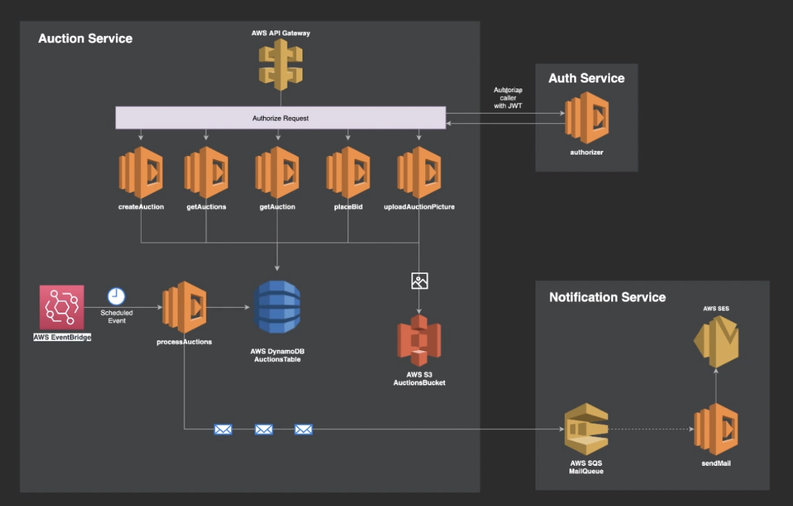

# Auctions Microservices

An application for sell tickets.

## Table of contents

- [About](#about)
- [Features](#features)
- [Technologies](#technologies)
- [Architecture](#architecture)
- [Status](#status)
- [Contact](#contact)

## About

The intention of doing this project was to understand how to develop an api based on microsevices architecture using serverless framework, on AWS environment.

## Features

List of features ready and TODOs for future development

- Auth
- Create Auction
- Search Auction
- Search Auction by Id
- Place bid
- Process Auctions
- Email Notification
- Upload Picture

To-do list:

- Add tests.
- Document API

## Technologies

- Serverless frameworkd - https://www.serverless.com/
- AWS lambda - https://aws.amazon.com/lambda/
- AWS DynamoDB - https://aws.amazon.com/dynamodb/
- AWS SES - https://aws.amazon.com/ses/
- AWS SQS - https://aws.amazon.com/sqs/
- AWS S3 - https://aws.amazon.com/s3/
- AWS EventBrige - https://aws.amazon.com/eventbridge/
- Auth0 - https://auth0.com/

## Architecture

## Status

Project is: _finished_

## Contact

Created by tiagovalentim@gmail.com - feel free to contact me!
